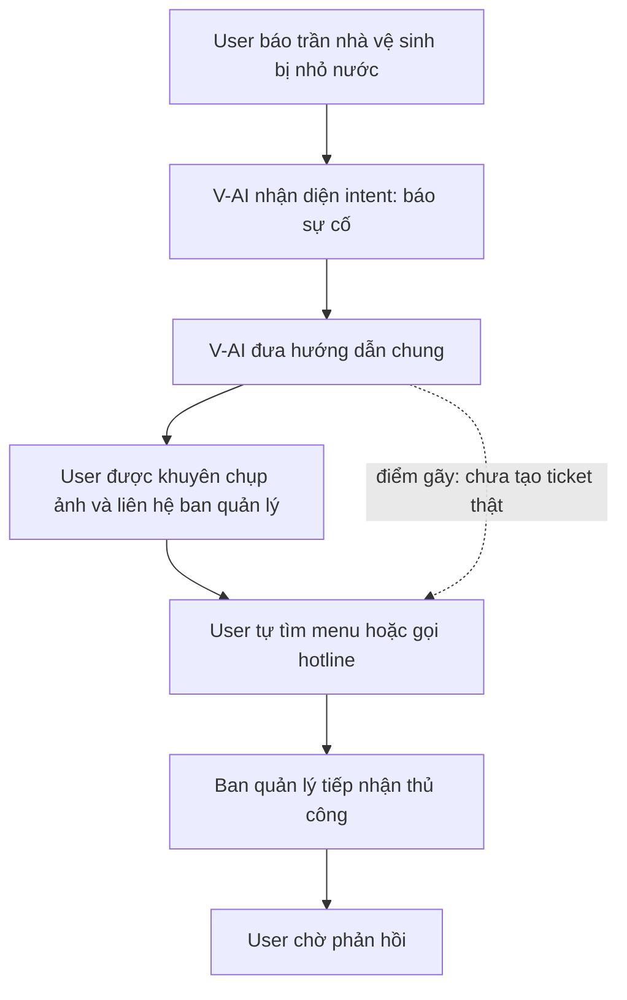
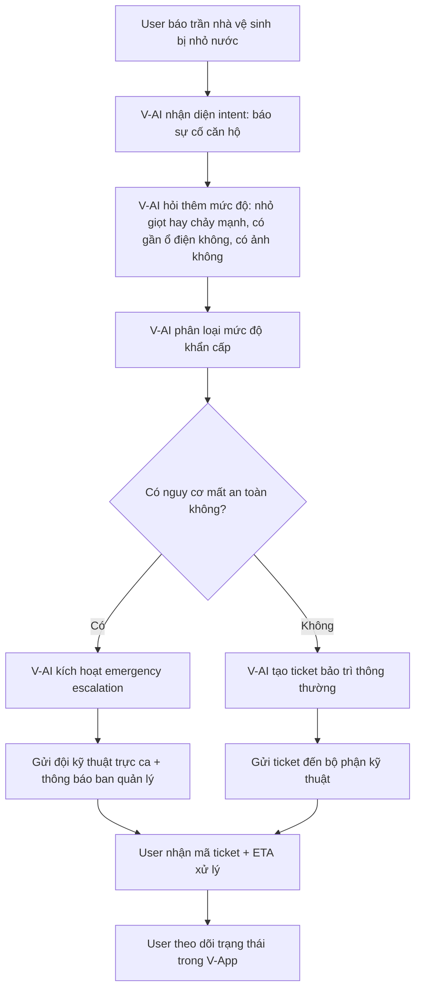
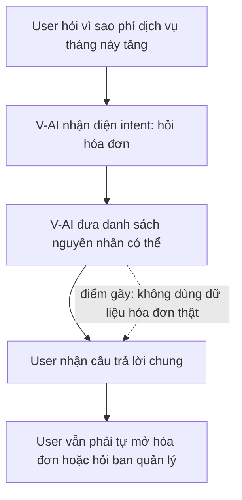
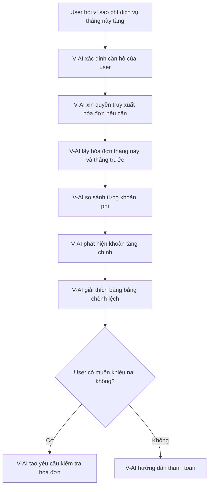
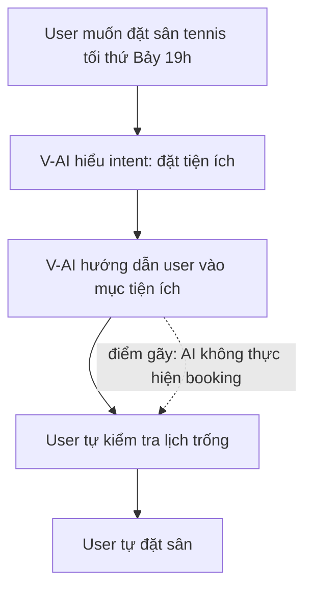
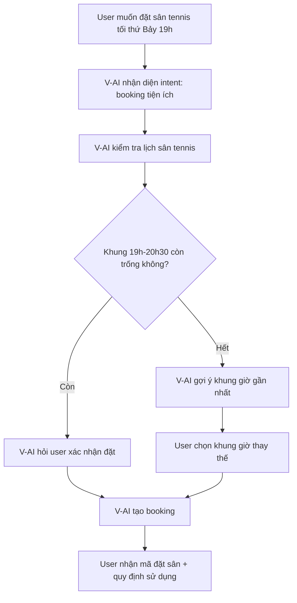
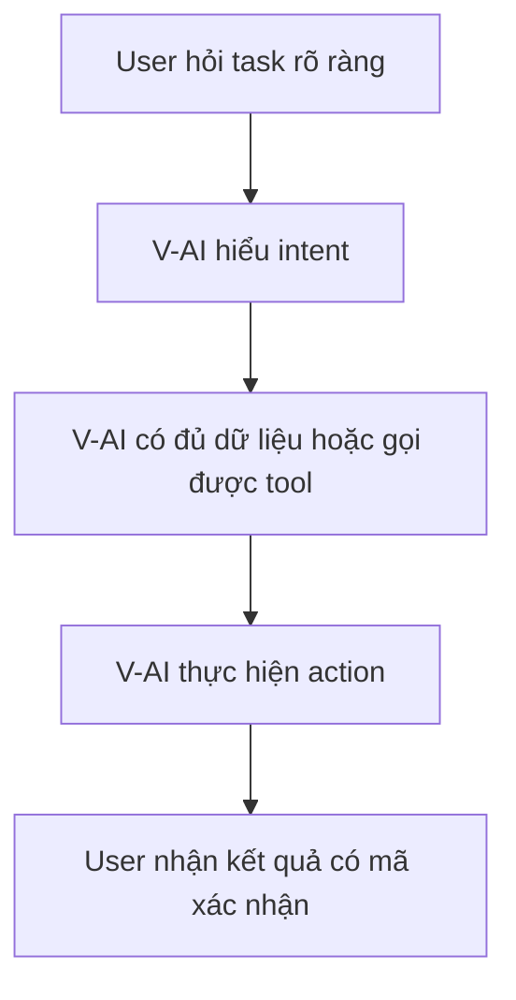
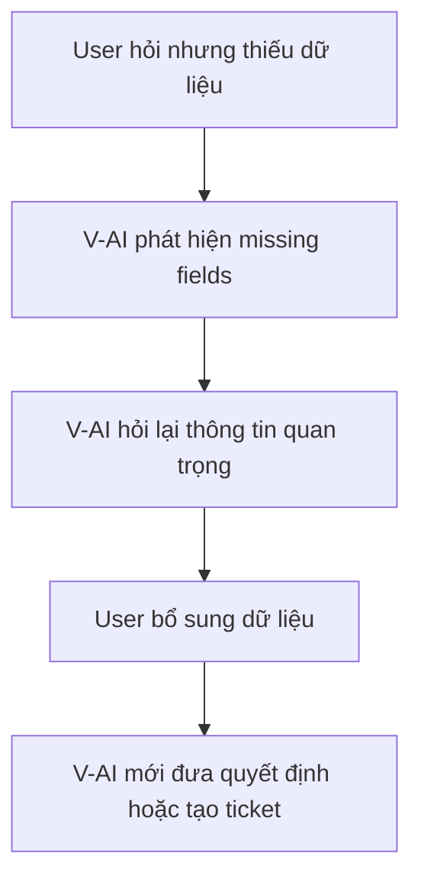
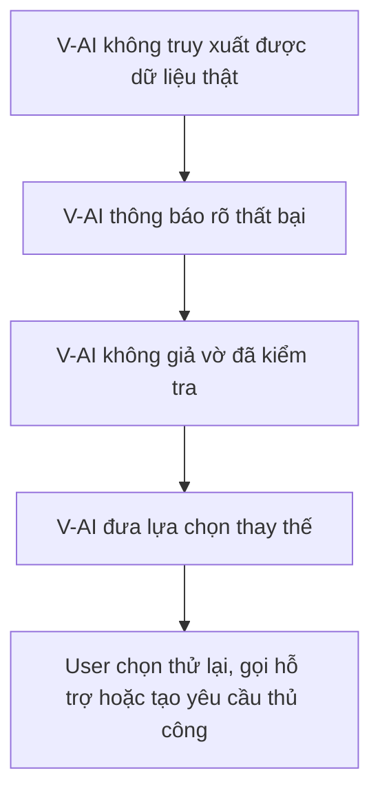
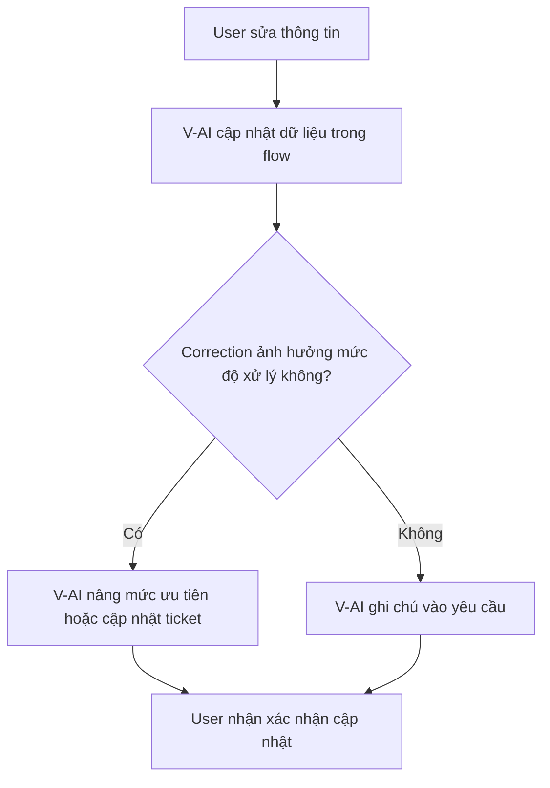

# Workshop — Mổ App AI Thật

**Sản phẩm được chọn:** V-App — V-AI\
**AI feature:** Trợ lý voice/text hỗ trợ cư dân trong hệ sinh thái Vingroup\
**Kịch bản phân tích:** Cư dân Vinhomes dùng V-AI để báo sự cố căn hộ, tra cứu phí dịch vụ, đặt tiện ích và theo dõi yêu cầu hỗ trợ\
**Thời gian thực hiện:** 35–45 phút\
**Hình thức:** cá nhân trước, chia sẻ theo nhóm sau\
**Output:** finding note + sketch `as-is / to-be`

---

# 1. Bối cảnh sản phẩm

## 1.1. Sản phẩm được chọn

Sản phẩm được chọn là **V-App — V-AI**, một trợ lý AI tích hợp trong V-App, có thể hỗ trợ người dùng qua hội thoại văn bản hoặc giọng nói.

Trong báo cáo này, trọng tâm không phải đánh giá giao diện đẹp hay xấu, mà là đánh giá xem V-AI có thật sự giải quyết được workflow đời sống của cư dân hay chưa.

## 1.2. Kịch bản mới

Kịch bản được chọn:

> Một cư dân Vinhomes dùng V-App để xử lý các nhu cầu hằng ngày trong khu đô thị: báo sự cố căn hộ, hỏi phí dịch vụ, đặt tiện ích chung và theo dõi tiến độ xử lý.

Đây là kịch bản phù hợp để kiểm tra giá trị thật của AI vì cư dân không chỉ cần câu trả lời chung chung. Họ cần hệ thống hiểu đúng căn hộ, tòa nhà, loại sự cố, mức độ khẩn cấp, trạng thái yêu cầu và có thể kết nối với ban quản lý hoặc đội kỹ thuật.

---

# 2. Promise vs Reality

## 2.1. Product hứa gì?

V-AI được kỳ vọng là một trợ lý AI có thể:

- Hiểu câu hỏi tự nhiên của cư dân.
- Hỗ trợ các thao tác thường gặp trong V-App.
- Giảm thời gian tìm menu, gọi hotline hoặc nhắn ban quản lý.
- Gợi ý hành động theo ngữ cảnh.
- Cá nhân hóa phản hồi dựa trên dữ liệu cư dân, căn hộ và dịch vụ đang sử dụng.

## 2.2. User nào được hứa sẽ được giúp?

Nhóm user chính trong kịch bản này:

- Cư dân Vinhomes.
- Chủ hộ hoặc người thuê căn hộ.
- Người thường xuyên dùng V-App để quản lý tiện ích.
- Người cần xử lý nhanh sự cố sinh hoạt.
- Người muốn kiểm tra phí dịch vụ, hóa đơn, lịch đặt tiện ích hoặc phản ánh với ban quản lý.

## 2.3. Kỳ vọng AI làm được task nào?

Tôi kỳ vọng V-AI có thể hỗ trợ tốt các task sau:

### Task 1 — Báo sự cố căn hộ

Ví dụ: mất nước, mất điện, rò rỉ trần, hỏng điều hòa, khóa cửa lỗi, thang máy hỏng.

AI cần:

- Hỏi đúng thông tin còn thiếu.
- Phân loại mức độ khẩn cấp.
- Tạo ticket hỗ trợ.
- Gửi cho đúng bộ phận kỹ thuật.
- Cho cư dân biết thời gian xử lý dự kiến.
- Theo dõi trạng thái yêu cầu.

### Task 2 — Tra cứu phí dịch vụ

Ví dụ: phí quản lý, phí gửi xe, tiền điện nước, khoản đã thanh toán, khoản còn nợ.

AI cần:

- Hiểu căn hộ của user.
- Truy xuất dữ liệu hóa đơn.
- Giải thích từng khoản phí rõ ràng.
- Cho biết hạn thanh toán.
- Hướng dẫn thanh toán hoặc khiếu nại nếu thấy bất thường.

### Task 3 — Đặt tiện ích chung

Ví dụ: đặt sân tennis, phòng sinh hoạt cộng đồng, BBQ, bể bơi, phòng gym, khu vui chơi.

AI cần:

- Hỏi ngày giờ muốn đặt.
- Kiểm tra tình trạng còn trống.
- Đưa ra lựa chọn thay thế nếu khung giờ đã kín.
- Xác nhận trước khi đặt.
- Gửi thông tin đặt chỗ sau khi hoàn tất.

---

# 3. Prompt/input đã thử

## Query 1 — Báo sự cố căn hộ

```text
Nhà tôi ở tòa S2.03, căn 1208. Tối nay trần nhà vệ sinh bị nhỏ nước liên tục, có vẻ nước chảy từ tầng trên xuống. Hãy giúp tôi báo sự cố cho ban quản lý và cho biết có cần xử lý khẩn cấp không.
```

## Query 2 — Tra cứu phí dịch vụ

```text
Tháng này tôi thấy phí dịch vụ căn hộ tăng hơn tháng trước. Hãy kiểm tra giúp tôi các khoản phí của căn 1208 và giải thích vì sao tổng tiền tăng.
```

## Query 3 — Đặt tiện ích chung

```text
Tôi muốn đặt sân tennis trong khu đô thị vào tối thứ Bảy tuần này, khoảng 19h đến 20h30. Nếu khung giờ đó hết chỗ thì gợi ý khung giờ gần nhất.
```

---

# 4. Hành vi quan sát được

## Observation 1 — Báo sự cố căn hộ

V-AI hiểu đúng đây là yêu cầu báo sự cố. Câu trả lời có hướng dẫn cơ bản như liên hệ ban quản lý, chụp ảnh hiện trường, mô tả tình trạng rò nước và tránh sử dụng thiết bị điện gần khu vực bị ẩm.

Tuy nhiên, AI chưa thể hiện rõ việc đã tạo ticket thật trong hệ thống. AI cũng chưa hỏi thêm các thông tin quan trọng như:

- Nước nhỏ nhiều hay ít?
- Có nguy cơ chập điện không?
- Trần có dấu hiệu bong, nứt hoặc phồng không?
- Có ảnh/video hiện trường không?
- Tầng trên có căn hộ đang sử dụng nước hay không?

**Điểm gãy:** AI hiểu intent nhưng chưa chuyển được từ “tư vấn” sang “xử lý nghiệp vụ thật”.

---

## Observation 2 — Tra cứu phí dịch vụ

V-AI có thể giải thích chung rằng phí dịch vụ có thể tăng do điện nước, gửi xe, phí quản lý, phí tiện ích hoặc khoản truy thu.

Tuy nhiên, nếu không truy cập được dữ liệu hóa đơn thật, câu trả lời vẫn chỉ ở mức phỏng đoán. Với một câu hỏi liên quan đến tiền, user cần thông tin chính xác theo căn hộ, không cần một danh sách nguyên nhân chung.

**Điểm gãy:** AI trả lời giống FAQ, chưa chứng minh được bằng dữ liệu hóa đơn cụ thể.

---

## Observation 3 — Đặt tiện ích chung

V-AI hiểu đúng yêu cầu đặt sân tennis, nhận ra khung giờ mong muốn và có thể đề xuất kiểm tra lịch trống.

Tuy nhiên, nếu AI không thật sự kết nối với hệ thống booking, user vẫn phải tự mở menu đặt sân. Điều này làm giảm giá trị của trợ lý AI vì AI chỉ hướng dẫn user quay lại workflow thủ công.

**Điểm gãy:** AI chưa hoàn thành action cuối cùng thay cho user.

---

# 5. Bảng phân tích nhanh

| Task                | User thật sự cần gì?                               | AI hiện tại có thể làm gì? | Điểm gãy chính                 |
| ------------------- | -------------------------------------------------- | -------------------------- | ------------------------------ |
| Báo sự cố căn hộ    | Tạo ticket, phân loại khẩn cấp, gọi đúng đội xử lý | Hướng dẫn chung            | Chưa có action/ticket rõ ràng  |
| Tra cứu phí dịch vụ | Giải thích khoản tăng dựa trên hóa đơn thật        | Nêu nguyên nhân có thể     | Thiếu dữ liệu hóa đơn          |
| Đặt tiện ích        | Kiểm tra slot trống và đặt chỗ                     | Gợi ý cách đặt             | Chưa kết nối booking tool      |
| Theo dõi yêu cầu    | Biết ticket đang ở trạng thái nào                  | Trả lời chung              | Thiếu trạng thái xử lý thực tế |

---

# 6. Vẽ 4 paths

## 6.1. Happy path

| Câu hỏi                                  | Quan sát                                                                                    |
| ---------------------------------------- | ------------------------------------------------------------------------------------------- |
| Khi AI đúng và đủ dữ liệu, user thấy gì? | AI hiểu yêu cầu, phân loại đúng task, trả lời có cấu trúc và đưa ra bước tiếp theo rõ ràng. |
| Ví dụ                                    | Với sự cố rò nước, AI khuyên chụp ảnh, tránh thiết bị điện và liên hệ ban quản lý.          |
| Giá trị                                  | User không phải tự mò menu hoặc gọi hotline ngay từ đầu.                                    |

## 6.2. Low-confidence path

| Câu hỏi                                          | Quan sát                                                                                                                      |
| ------------------------------------------------ | ----------------------------------------------------------------------------------------------------------------------------- |
| Khi AI thiếu dữ liệu, hệ thống có hỏi lại không? | Chưa thấy low-confidence path rõ ràng. AI thường trả lời ngay bằng thông tin tổng quát.                                       |
| Ví dụ                                            | Khi hỏi phí dịch vụ tăng, AI có thể nêu nhiều nguyên nhân nhưng không nói rõ “tôi chưa truy cập được hóa đơn của căn hộ này”. |
| Vấn đề                                           | User dễ tưởng AI đã kiểm tra dữ liệu thật trong khi thực tế chỉ đang suy luận chung.                                          |

## 6.3. Failure path

| Câu hỏi                                                        | Quan sát                                                                                                         |
| -------------------------------------------------------------- | ---------------------------------------------------------------------------------------------------------------- |
| Khi AI sai hoặc không đủ quyền xử lý, user biết bằng cách nào? | Chưa rõ. AI có thể nói theo hướng chắc chắn nhưng không đánh dấu phần nào là dữ liệu thật, phần nào là giả định. |
| Ví dụ                                                          | AI nói “phí tăng có thể do điện nước” nhưng không có bảng hóa đơn kèm theo.                                      |
| Vấn đề                                                         | Với các task liên quan đến tiền hoặc sự cố khẩn cấp, thông tin mơ hồ có thể gây thiệt hại hoặc chậm xử lý.       |

## 6.4. Correction path

| Câu hỏi                                               | Quan sát                                                                                        |
| ----------------------------------------------------- | ----------------------------------------------------------------------------------------------- |
| Khi user sửa thông tin, correction có được lưu không? | Chưa thấy bằng chứng rằng correction được lưu vào ticket, hồ sơ căn hộ hoặc preference.         |
| Ví dụ                                                 | User nói “không phải rò nhẹ, nước đang chảy thành dòng” thì hệ thống cần tự nâng mức khẩn cấp.  |
| Vấn đề                                                | Nếu correction chỉ nằm trong đoạn chat, đội vận hành có thể không nhận được thông tin cập nhật. |

---

# 7. Finding thành quyết định product

## Finding 1 — AI hiểu câu hỏi nhưng chưa đóng được workflow

```text
Khi cư dân dùng V-AI để báo sự cố căn hộ hoặc đặt tiện ích,
AI có thể hiểu đúng ý định và đưa ra hướng dẫn,
nhưng chưa thể hiện rõ việc tạo ticket, kiểm tra lịch trống hoặc gửi yêu cầu thật đến hệ thống vận hành,
hậu quả là user vẫn phải quay lại thao tác thủ công trong app hoặc gọi ban quản lý.
Lỗi thuộc layer Action-tool + Workflow Integration.
Nên sửa bằng requirement: với các task vận hành có thể hành động, AI phải kết nối tool nội bộ để tạo ticket, đặt lịch, kiểm tra trạng thái và xác nhận kết quả cho user.
```

**Product decision:**

Không nên định vị V-AI chỉ là chatbot hướng dẫn. Với các workflow cư dân, V-AI cần trở thành **operation assistant**: nhận yêu cầu, kiểm tra dữ liệu, thực hiện action và trả về mã xác nhận.

---

## Finding 2 — AI chưa phân biệt rõ dữ liệu thật và suy luận

```text
Khi cư dân hỏi về phí dịch vụ hoặc trạng thái yêu cầu,
AI có thể đưa ra câu trả lời nghe hợp lý nhưng không chứng minh được đã truy xuất dữ liệu thật,
hậu quả là user có thể nhầm lẫn giữa thông tin chính thức và gợi ý tham khảo.
Lỗi thuộc layer Data Transparency + Trust.
Nên sửa bằng requirement: mọi câu trả lời liên quan đến hóa đơn, thanh toán hoặc ticket phải hiển thị nguồn dữ liệu, thời điểm cập nhật và trạng thái truy xuất thành công hay thất bại.
```

**Product decision:**

V-AI cần có cơ chế **evidence-first response**. Trước khi giải thích phí hoặc trạng thái xử lý, AI phải nói rõ:

- Đã truy xuất dữ liệu căn hộ nào.
- Dữ liệu cập nhật lúc nào.
- Khoản nào là số liệu chính thức.
- Khoản nào chỉ là giải thích tham khảo.

---

## Finding 3 — Thiếu cơ chế xử lý khẩn cấp

```text
Khi user báo sự cố có rủi ro như rò nước, chập điện, kẹt thang máy hoặc mất an toàn,
AI chưa thể hiện rõ cơ chế phân loại khẩn cấp và escalation,
hậu quả là sự cố nghiêm trọng có thể bị xử lý như yêu cầu thông thường.
Lỗi thuộc layer Risk Classification + Escalation.
Nên sửa bằng requirement: AI phải nhận diện các tín hiệu nguy hiểm và chuyển sang emergency flow thay vì trả lời tư vấn chung.
```

**Product decision:**

V-AI cần có **emergency escalation path**. Với sự cố nguy hiểm, AI phải ưu tiên an toàn trước, sau đó mới xử lý ticket.

---

# 8. Sketch as-is / to-be

## 8.1. Flow 1 — Báo sự cố rò nước căn hộ

### As-is



### To-be



---

## 8.2. Flow 2 — Tra cứu phí dịch vụ tăng bất thường

### As-is



### To-be



---

## 8.3. Flow 3 — Đặt sân tennis

### As-is



### To-be



---

# 9. Tổng hợp 4 paths cho V-AI trong kịch bản cư dân

## 9.1. Happy path



**Ví dụ mong muốn:**

User báo rò nước, V-AI tạo ticket, phân loại khẩn cấp, gửi đội kỹ thuật và trả về mã yêu cầu.

---

## 9.2. Low-confidence path



**Ví dụ mong muốn:**

User nói “nhà tôi bị rò nước”, V-AI cần hỏi thêm vị trí rò, mức độ rò, có gần điện không, có ảnh không.

---

## 9.3. Failure path



**Ví dụ mong muốn:**

Nếu không lấy được hóa đơn, V-AI phải nói rõ: “Tôi chưa truy xuất được hóa đơn căn hộ 1208, phần dưới đây chỉ là các nguyên nhân thường gặp.”

---

## 9.4. Correction path



**Ví dụ mong muốn:**

User ban đầu nói “rò nhẹ”, sau đó sửa thành “nước chảy mạnh gần ổ điện”. V-AI phải tự nâng mức khẩn cấp và thông báo cho đội kỹ thuật.

---

# 10. Finding note cuối cùng

## Finding chính

```text
Khi cư dân dùng V-AI để xử lý các việc vận hành trong khu đô thị như báo sự cố, hỏi phí dịch vụ hoặc đặt tiện ích,
AI có thể hiểu đúng câu hỏi và trả lời có cấu trúc,
nhưng chưa đủ bằng chứng cho thấy AI đã kết nối với dữ liệu và hệ thống hành động thật như ticket, hóa đơn, lịch đặt tiện ích,
hậu quả là user vẫn phải quay lại quy trình thủ công và không nhận được giá trị vượt trội so với chatbot FAQ.
Lỗi thuộc layer Action-tool + Data Transparency + UX Recovery.
Nên sửa bằng requirement: V-AI phải chuyển từ “answer assistant” sang “workflow assistant”, có khả năng kiểm tra dữ liệu, thực hiện action, xác nhận kết quả và theo dõi trạng thái.
```

## Product decision

```text
V-AI không nên chỉ tối ưu khả năng trả lời tự nhiên.
Với các task cư dân, SPEC cần bổ sung yêu cầu bắt buộc: mỗi intent vận hành phải có action path rõ ràng.
Nếu AI có thể xử lý, nó phải tạo ticket, đặt lịch, truy xuất hóa đơn hoặc cập nhật trạng thái.
Nếu AI không thể xử lý, nó phải nói rõ giới hạn và chuyển user sang fallback phù hợp.
```

---

# 11. SPEC change đề xuất

## Requirement 1 — Intent-to-action mapping

```text
V-AI must map resident intents to executable actions when the task belongs to building operations, billing, facility booking, or maintenance support.
```

Ví dụ:

| Intent                 | Action cần có                  |
| ---------------------- | ------------------------------ |
| Báo rò nước            | Tạo ticket kỹ thuật            |
| Hỏi phí dịch vụ        | Truy xuất hóa đơn              |
| Đặt sân tennis         | Kiểm tra slot và tạo booking   |
| Hỏi trạng thái yêu cầu | Lấy trạng thái ticket          |
| Báo sự cố nguy hiểm    | Escalate đến đội trực khẩn cấp |

---

## Requirement 2 — Evidence-first response

```text
For billing, maintenance, and booking tasks, V-AI must clearly separate verified data from assumptions.
```

Ví dụ response tốt:

```text
Tôi đã kiểm tra hóa đơn căn hộ S2.03-1208, dữ liệu cập nhật lúc 09:20 ngày 03/06/2026.

Khoản tăng chính là:
- Tiền nước: tăng 120.000đ
- Phí gửi xe: tăng 300.000đ do thêm một xe máy
- Phí tiện ích: tăng 80.000đ

Các số liệu trên lấy từ hóa đơn tháng này. Phần giải thích dưới đây là phân tích của V-AI.
```

---

## Requirement 3 — Emergency classification

```text
V-AI must classify incident severity before creating maintenance tickets.
```

Bảng phân loại đề xuất:

| Mức độ     | Dấu hiệu                                        | Action                            |
| ---------- | ----------------------------------------------- | --------------------------------- |
| Thấp       | Hỏng nhẹ, không nguy hiểm                       | Tạo ticket thường                 |
| Trung bình | Ảnh hưởng sinh hoạt nhưng chưa nguy hiểm        | Tạo ticket ưu tiên                |
| Cao        | Rò nước mạnh, chập điện, kẹt thang, mất an toàn | Escalate ngay                     |
| Khẩn cấp   | Có nguy cơ gây hại cho người hoặc tài sản       | Gọi đội trực và thông báo hotline |

---

## Requirement 4 — Confirmation before action

```text
Before creating bookings, payments, or official requests, V-AI must show a confirmation step.
```

Ví dụ:

```text
Tôi sẽ tạo yêu cầu bảo trì với thông tin sau:

- Căn hộ: S2.03-1208
- Sự cố: Rò nước trần nhà vệ sinh
- Mức độ: Ưu tiên cao
- Ghi chú: Nước nhỏ liên tục từ trần, cần kiểm tra căn phía trên

Bạn muốn gửi yêu cầu này không?
```

---

## Requirement 5 — Structured correction loop

```text
V-AI must allow users to update, correct, or escalate an existing request without restarting the conversation.
```

Action cần có:

- Sửa thông tin ticket.
- Thêm ảnh/video.
- Nâng mức độ khẩn cấp.
- Hủy yêu cầu.
- Kiểm tra trạng thái.
- Gửi phản hồi sau xử lý.

---

# 12. Kết luận

V-AI có tiềm năng lớn nếu được đặt đúng vai trò: không chỉ là chatbot trả lời câu hỏi, mà là trợ lý vận hành trong hệ sinh thái Vingroup.

Trong kịch bản cư dân Vinhomes, giá trị thật của V-AI không nằm ở việc trả lời dài hay văn vẻ, mà nằm ở khả năng:

1. Hiểu đúng nhu cầu cư dân.
2. Hỏi lại khi thiếu dữ liệu.
3. Kết nối dữ liệu thật.
4. Thực hiện action trong hệ thống.
5. Xác nhận kết quả.
6. Theo dõi và cập nhật trạng thái.

Nếu không có các capability này, V-AI dễ bị rơi vào vai trò FAQ chatbot. Nếu làm tốt, V-AI có thể trở thành lớp giao tiếp tự nhiên giữa cư dân và toàn bộ hệ thống vận hành khu đô thị.

---

# 13. Tự kiểm trước khi nộp

- [x] Có sản phẩm thật: V-App — V-AI.
- [x] Có kịch bản khác so với mẫu: cư dân Vinhomes xử lý sự cố, phí dịch vụ, đặt tiện ích.
- [x] Có promise vs reality.
- [x] Có ít nhất 3 observation cụ thể.
- [x] Có đủ 4 paths: happy, low-confidence, failure, correction.
- [x] Có finding viết thành product decision.
- [x] Có sketch as-is / to-be.
- [x] Có SPEC change rõ ràng.
- [x] Có kết luận về việc thay đổi product requirement.
